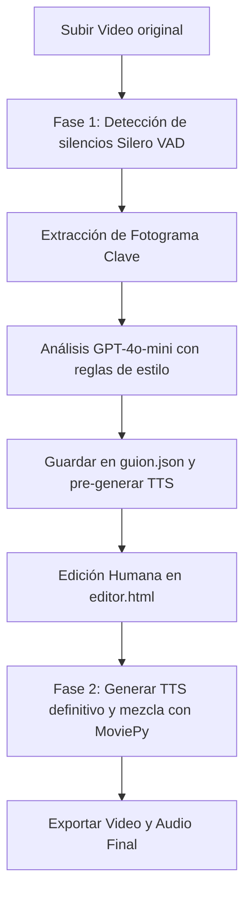

# Handoff del Proyecto: AudescAI

Este documento contiene toda la información técnica, de arquitectura y de flujo de trabajo de **AudescAI**, una plataforma premium para la creación autónoma y co-creación humana de audiodescripciones para cine y videos accesibles.

---

## 1. Visión General del Proyecto
**AudescAI** permite a universidades, creadores y productoras cumplir con las normativas de accesibilidad (como WCAG / ADA) automatizando la generación de audiodescripción mediante Inteligencia Artificial y permitiendo refinamiento humano en una interfaz de edición interactiva.

---

## 2. Arquitectura de Archivos y Directorios
El proyecto está estructurado de forma ligera en el frontend y con un servidor monolítico en Python en el backend:

*   **[`tu_script.py`](file:///c:/Users/Hamt/Desktop/APP%20AUDIOCINE/tu_script.py)**: Servidor Backend en Flask. Gestiona la lógica de procesamiento (detección de silencios, análisis visual con GPT-4o-mini, síntesis de voz con Edge-TTS y mezcla/renderizado final con MoviePy).
*   **[`index.html` (Landing)](file:///c:/Users/Hamt/Desktop/APP%20AUDIOCINE/index.html)**: Página de presentación del producto con diseño premium en dark mode, presentación de planes y acceso directo al Dashboard.
*   **[`dashboard.html` (Gestor de Proyectos)](file:///c:/Users/Hamt/Desktop/APP%20AUDIOCINE/dashboard.html)**: Panel de control de proyectos donde se suben nuevos videos y se gestiona el estado de procesamiento (con integración de webhook a n8n y fallback a Flask).
*   **[`editor.html` (Editor de Video Web)](file:///c:/Users/Hamt/Desktop/APP%20AUDIOCINE/editor.html)**: Herramienta avanzada con línea de tiempo interactiva (usando Interact.js), reproductor de video HTML5 sincrónico, previsualización de voz en caliente y controles de tiempo detallados.
*   **[`guion.json`](file:///c:/Users/Hamt/Desktop/APP%20AUDIOCINE/guion.json)**: Archivo de datos persistente que guarda el estado de los bloques de audiodescripción (tiempos de inicio/fin, texto, voz, y conflictos de duración).
*   **Directorios de Trabajo (Locales)**:
    *   `CARPETA_VIDEO/`: Ubicación donde se almacena el video original a procesar.
    *   `RESULTADOS_AD/`: Carpeta de exportación de videos finales con la pista de audiodescripción integrada.
    *   `TEMP_PROCESAMIENTO/`: Directorio temporal para extracción de audio, imágenes de fotogramas, caché de audios TTS de Edge, y mezclas intermedias.

---

## 3. Flujo del Sistema (Pipeline de Audiodescripción)

El flujo de procesamiento consta de dos fases principales:



### Fase 1: Análisis y Generación Automatizada
1.  **Detección de Silencios (VAD)**: El backend convierte el audio del video a WAV y usa **Silero VAD** para identificar huecos de diálogo mayores a 2.2 segundos.
2.  **Análisis por Visión Artificial**: Para cada silencio, se toma un fotograma clave del video y se envía a **GPT-4o-mini** junto con un historial conversacional para generar una descripción precisa en español de España (evitando repetir lugares/tiempos y omitiendo el sujeto si es la misma persona que el bloque anterior).
3.  **Caché de Voz**: Las descripciones generadas se envían asíncronamente a **edge-tts** para cachear los audios en formato MP3 y estructurar el archivo `guion.json`.

### Fase 2: Co-Creación Humana y Renderizado
1.  **Interfaz de Edición**: El usuario visualiza los bloques en la línea de tiempo en `editor.html`. Puede arrastrar los límites, cambiar el texto, la voz de la IA, o añadir nuevos bloques.
2.  **Validación de Conflictos**: El frontend calcula en tiempo real si el texto redactado cabe físicamente en el silencio disponible (tiempo disponible vs longitud del texto a una velocidad promedio de 15 caracteres por segundo).
3.  **Fusión Final**: Al hacer clic en "Renderizar", el backend lee el guion actualizado, genera los audios TTS definitivos, atenúa (ducking al 60%) la pista de sonido original del video e inserta las pistas de audiodescripción amplificadas (150%). Exporta el video completo y permite descargar el audio mezclado por separado.

---

## 4. Tecnologías y Librerías Utilizadas
### Backend (Python 3.10+)
*   **Flask / Flask-CORS**: API REST para comunicar frontend y backend.
*   **MoviePy**: Manipulación de clips de video, pistas de audio compuestas y renderizado final.
*   **OpenAI SDK**: Conexión con GPT-4o-mini para generación de textos de audiodescripción a partir de fotogramas.
*   **Silero VAD**: Filtro de detección de actividad de voz de alta precisión para segmentar huecos de silencio.
*   **Edge-TTS**: Motor de síntesis de voz en la nube de alta fidelidad que ofrece voces neurales muy realistas sin coste de API adicional.

### Frontend
*   **HTML5 / JavaScript Moderno**: Arquitectura vainilla sin frameworks pesados para un rendimiento óptimo.
*   **Tailwind CSS**: Estilizado visual premium y dinámico (Glassmorphism, Dark mode, animaciones personalizadas).
*   **Interact.js**: Motor para el manejo de arrastre, redimensionado y posicionamiento de bloques de audio en la línea de tiempo.

---

## 5. Instrucciones de Configuración y Despliegue

### Requisitos Previos
1.  Tener instalado Python 3.8 o superior.
2.  Tener instalada la herramienta de procesamiento multimedia **FFmpeg** en el sistema operativo y agregada a las variables de entorno.

### Servidor Local
Para iniciar el servidor backend de procesamiento:

```powershell
# Instalar dependencias si no se instalan automáticamente
pip install flask flask-cors openai moviepy edge-tts silero-vad

# Ejecutar el backend
python tu_script.py
```
*El backend se ejecutará en http://localhost:5000.*

### Ejecutar el Frontend
Simplemente abre [`index.html`](file:///c:/Users/Hamt/Desktop/APP%20AUDIOCINE/index.html) en tu navegador preferido o utilízalo a través de un servidor web local sencillo (como Live Server o `python -m http.server`).

---

## 6. Recomendaciones de Seguridad e Implementación Futura

> [!WARNING]
> **Clave API de OpenAI**: Actualmente, la clave de OpenAI está hardcodeada directamente en `tu_script.py` (Línea 41). Se recomienda encarecidamente mover esta clave a una variable de entorno (`.env`) antes de subir el proyecto a producción o repositorios públicos.

> [!IMPORTANT]
> **Integración Webhook n8n**: El dashboard intenta enviar el video a un webhook local de n8n (`http://localhost:5678/webhook/procesar-video`). Si n8n no está activo, el sistema continuará ejecutando el procesamiento directamente en el servidor Flask. Asegúrate de configurar este flujo en n8n si vas a utilizarlo para automatizar pipelines más complejos.
